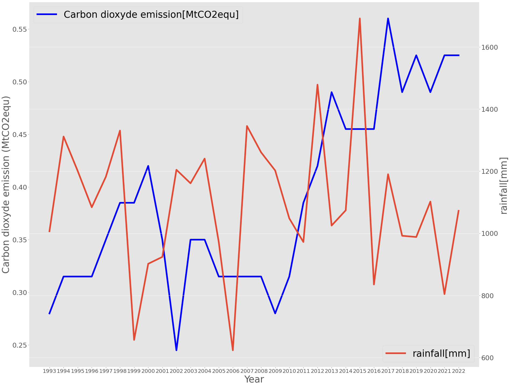
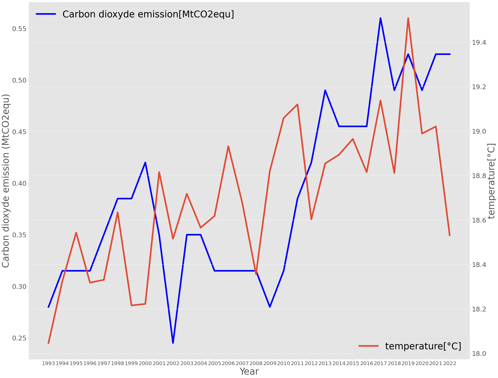
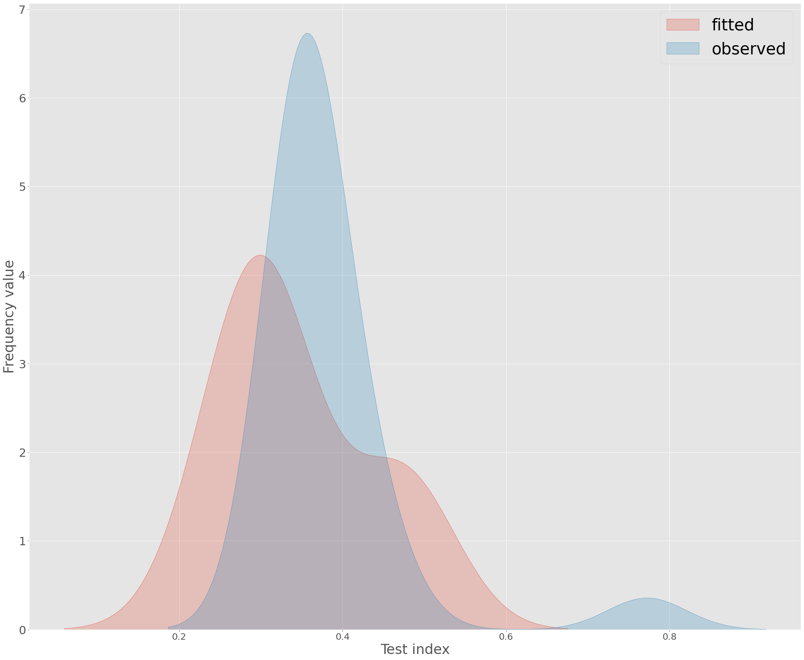

# Climate Trends in Analamanga (1993–2022)  

This repository analyzes historical climate data for Madagascar's Analamanga region, focusing on **rainfall, temperature, and CO₂ emissions** from 1993 to 2022. The project explores trends, correlations, and predictive modeling using visualized datasets.  
The meteorological parameters dataset is issued from the national weather service of Madagascar with a reanalysis data, the carbon dioxyde emission dataset is from www.climatewatchdata.org.
## 📊 Plots Overview  

1. **Rainfall Distribution**  
   - Annual rainfall variability with no clear long-term trend.
   - The mean value observed in 30 years is 1096 mm,which is considered as the normal rainfall value of the region.
   - The standart deviatio is 222 mm,that means rainfall for the region is not very stable.
   - The minimal value observed is in 2006 which is related to 623mm of rainfall, and the maximum value is located in 2015 with a value of 1692 mm, related to a great flood in the region
   -Rainfall for the region is decreasing by 1.17 mm per year, but statistical test tells that rainfall is not related with years with a correlation coefficient value of -0.045. 
   -  Potential influences: Monsoon cycles, ENSO, and local topography.
   -  

2. **Temperature Trends**  
   - Stable annual averages (18.0°C–19.4°C) with minor fluctuations. The average value is 18.69°C with a standard deviation of 0.32°C, which means that temperture is pretty stable .The maximum value is in 2019 with a mean temperature of 19.5°C and the minimum value is in 1993 with a temperature of 18.04°C.
   - The plot shows that temperature is increasing by year, with an increase of 0.03°C per year, and with a correlation coefficient of 0.72 we can confirm a presence of correlation with time.
   - 

3. **CO₂ Emissions**  
   - We can see an increase with time,especially since 2010. The mean value is 0.389 MtCO2eq with a standard deviation of 0.08 MtCO2eq, which is averagely stable. The max value is in 2017 (0.56 MtCO2eq) and the minimum value in 2002 (0.25 MtCO2eq).
   - Correlation with time is confirmed with a correlation coefficient of 0.77, and Carbon Dioxyde emission is increasing by 0.0078 MtCO2eq per year  
   - Global vs. local factors may explain the disconnect.
   -  

4. **Rainfall vs. CO₂ Emissions**  
   - No direct relationship found; rainfall likely driven by oceanic-atmospheric cycles. (Correlation coefficient : -0.1)
   - - 

5. **Temperature vs. CO2 Emissions**
   - Visible relation between the two parameters, both are increasing by time (Correlation coefficient : 0.52)
   -      

7. **CO₂ Prediction Model with the Support Vector Machine**  
   - Fitted vs. observed emissions show close alignment, suggesting a robust forecasting approach, but the r-squarred score is low (0.35)
   - RMSE : 0.0091 MtCO2eq/ MAE : 0.07 MtCO2eq
    - 

## 🔍 Key Insights  
- Local CO₂ emissions do not strongly correlate with rainfall changes in Analamanga but is correlate with temperature.  
- Temperature stability contrasts with global warming trends, possibly due to regional buffering effects.  
- Rainfall patterns remain variable but without significant directional shifts.  

## 🛠️ Tools & Methods  
- Data: Historical climate records (1993–2022).  
- Analysis: Trend detection, correlation tests, and Support Vector Machine ML model with SciKit-learn.  
- Visualization: Matplotlib and Seaborn, .  

